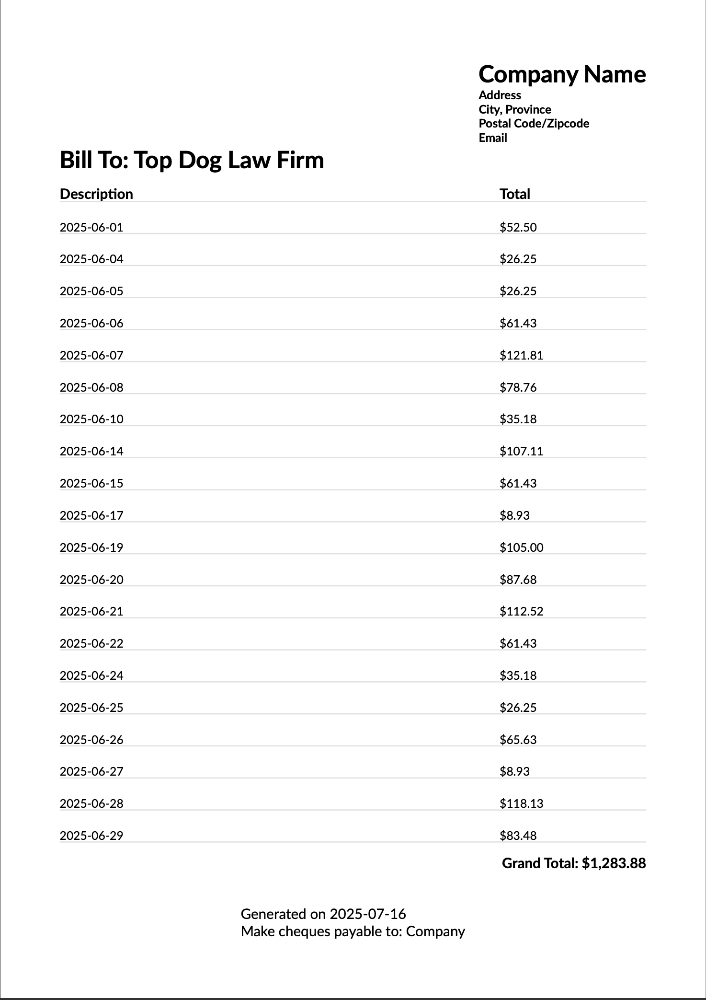

# Invoice Generator (ASP.NET Core + ClosedXML)


An ASP.NET Core application that generates PDF invoices from uploaded Excel files.

This is a simple web app built in ASP.NET Core that:
- Uploads Excel files via a web interface
- Reads invoice data from specific rows
- Generates styled PDF invoices using [QuestPDF](https://www.questpdf.com/)

## 🔧 Technologies Used

- ASP.NET Core MVC (Web backend & routing)
- C# (Application logic)
- ClosedXML (Excel reading)
- QuestPDF (PDF generation)
- Bootstrap (UI styling)

## 🧪 Features

- Upload Excel files (.xlsx)
- Extract rows and convert to invoice items
- Display total amounts as currency
- Render professional PDF invoices with logo, address, and totals
- Search functionality for matching records

## 📊 Example Excel File

An example file is provided at:

📄 (Sample.xlsx)

Use this file to test the application locally.

> 📝 This file contains **made-up data** for demonstration purposes only.

## 🔐 Data Privacy Notice

This project uses **fictional sales data** to demonstrate functionality. No real customer or financial data is used or exposed.

## 📷 Screenshots

## Sample Invoice


## 🚀 Getting Started

### Prerequisites
- .NET 6 or later
- Visual Studio Code or Visual Studio
- Git

### Setup Instructions

1. Clone the repo:
   ```bash
   git clone https://github.com/GurjinderJohal/InvoiceGenerator.git
   cd InvoiceGenerator
